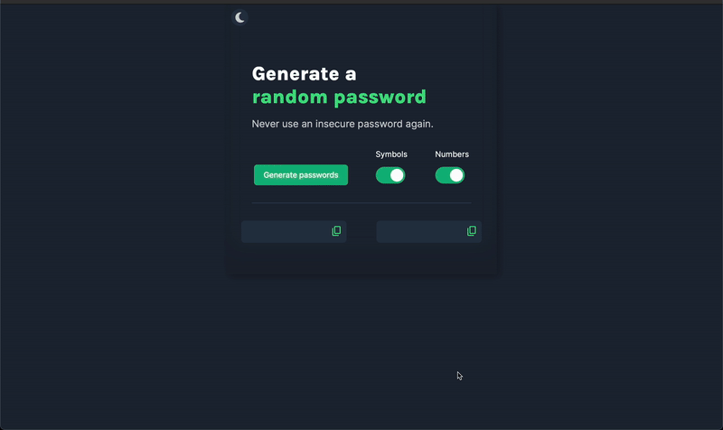

# Password Generator
 This app provides a simple and easy way to generate passwords. It supports choosing whether you want numbers or symbols in them.

## Features

- Generate passwords of 15 length
- Supports choosing numbers or symbols
- Permit copying passwords to the clipboard with an easy button
- Provides clear and easy-to-read results on any device
- Has a dark mode toggle button for user's convenience

## Technologies Used

This application is built using the following technologies:

- HTML
- CSS
- JavaScript

## What I Learned

This project reinforced my knowledge of JavaScript, and provided opportunity to apply HTML and CSS skills. I had the chance to:

- Use HTML to structure the web page
- Use CSS to style the web page and create a responsive design
- Use JavaScript to handle user input, perform calculations, and update the DOM
- Use local storage to store and retrieve data
- Implement a dark mode toggle button using JavaScript

## Live demo

View the app [live preview](https://wfpasswordgenerator.netlify.app/)
